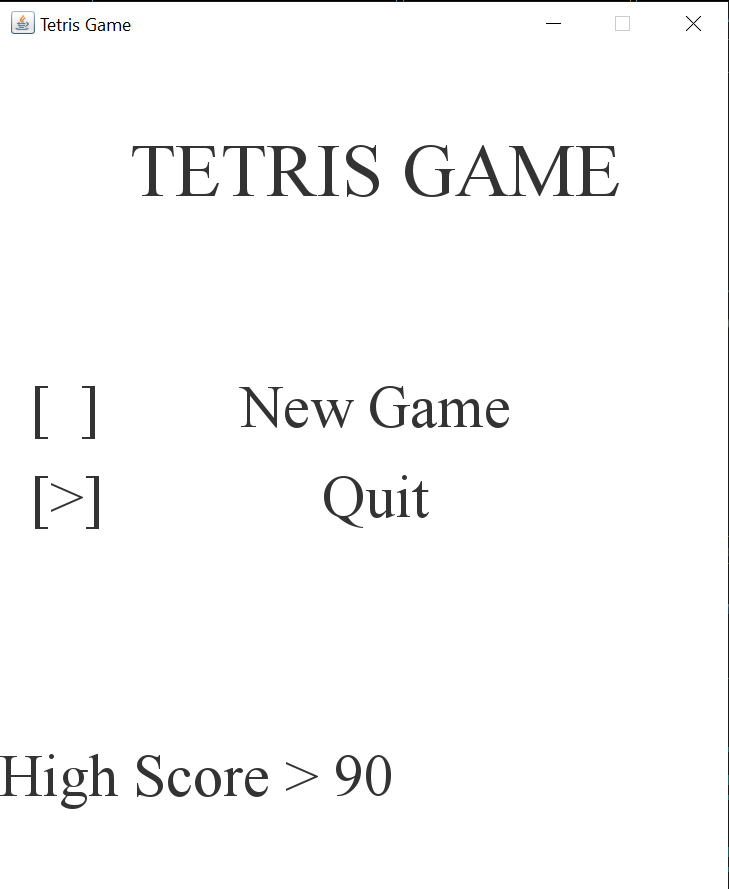

Idea
---

A java tetris game.

> The aim of this project is not only to make a good looking java application but also to learn the basics of java, and to get comfortable coding in java language. Plus get better at writting cleancode in java.
```
Aim of the project
> Learn java language
> Practice writting cleancode
> practice Object Oriented programming
> learn Game-Dev basics
> Build a project skill to show off :)
> ... Having fun...

```

Screens

- Splash Screen: showing the game logo... (to be implemented last)

- Home screen: which can be used to provide option Play, showing the current high-score.

 

- Game play Screen: Where you play the game.

 

Features:
- The normal game functionality
	- Different shapes
	- key Strokes:
		- `j Key` : shift shape one block left
		- `l Key` : shift shape one block right
		- `k Key` : move one step down (makes the fall faster)
		- `i - key` : Rotate the shape
		- `Space Key` : move the shape all the way down.
		- `P - key` : Pause / Play
		- `Esc - key` : exit the pause menu

- High-score Recording : record the high-score so far.
- Sound Effects :
	- A background music
	- removing a horizontal line full of blocks.
	- touching the space key to move the shape all the way down.
	- Game Over Sound


---
[`progress track`](https://app.clickup.com/9009124457/v/l/s/90090257110)<br>
[`online game play`](https://tetris.com/play-tetris)<br>
[`Tutorial I Used`](https://youtu.be/dgVh6S8X25k)
